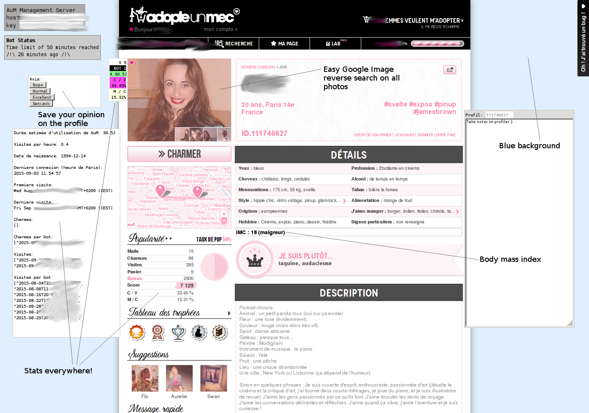
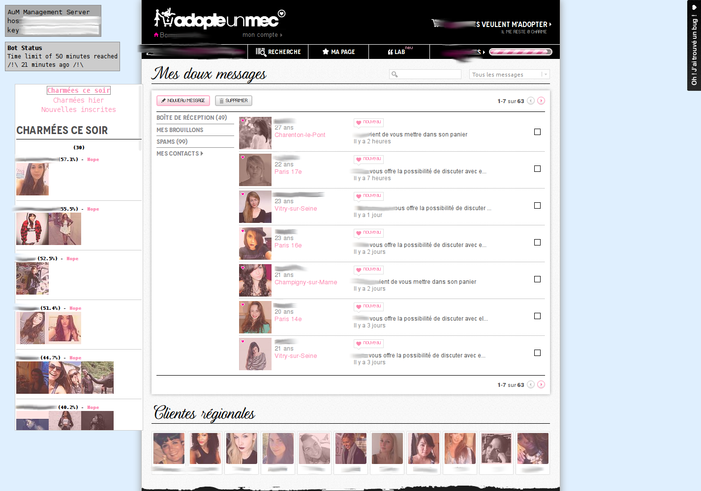
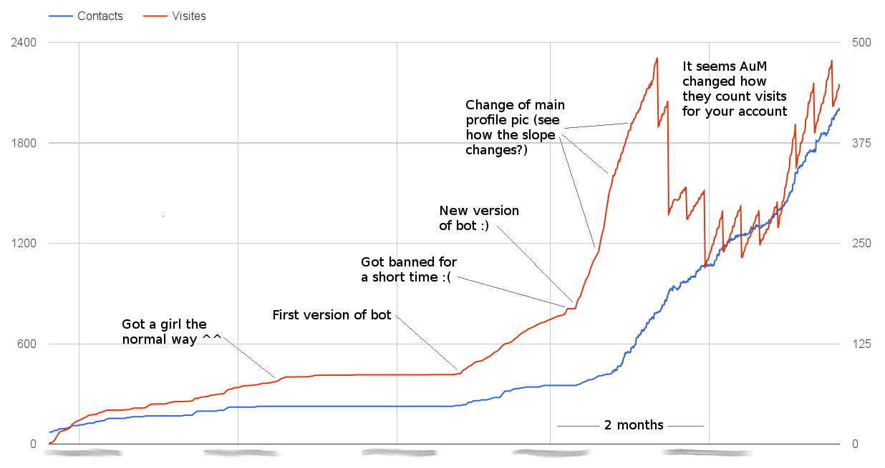

Adopte-Server 
==================================================================================

This is a small Node.js server for handling a Adopte-Un-Mec (AuM) Greasemonkey script and Phantombuster bot.

Its main job is to store women profiles in MongoDB for stats and auto-messaging by the bot.

The greasemonkey script is available in `greasemonkey/` for all Firefox users. However the Phantombuster bot will remain closed-source for now (for obvious reason) — this repository remains very useful without it.

Server
------

Note: the HTML/AngularJS views are, it seems, completely broken. I don't have time to fix them so they'll stay that way. They're not very useful anyway. This is a [Yeoman](http://yeoman.io/) deployment with lots of unused stuff...

Obviously you need a running MongoDB server.

1. `npm install`
2. `bower install` (or not, we don't really care about the broken HTML views)
3. `cd server/config`
4. `cp config.local.sample.coffee config.local.coffee`
5. `vim config.local.coffee` and configure
6. `cd ../..`
7. `grunt build` (don't know if it's needed or not...)
8. `PORT=50757 grunt serve`

SSL
---

Optionally enable SSL by adding `sslcert/server.key` and `sslcert/server.crt`.

Greasemonkey
------------

1. `cd greasemonkey`
2. `coffee -w -o ~/.mozilla/firefox/XXXXX.default/gm_scripts/YYYYY/ -c aum.user.coffee`
3. `cp config.sample.js ~/.mozilla/firefox/XXXXX.default/gm_scripts/YYYYY/config.js`
4. `vim ~/.mozilla/firefox/XXXXX.default/gm_scripts/YYYYY/config.js` and configure
5. Visit [AuM](http://www.adopteunmec.com/) and enjoy!

Account stats
-------------

The bot will automatically collect stats over time, however you might want to generate stats from the beginning of your subscription to AuM.

It's useful if you want to know what profile photo works best over time, for example.

To generate all your stats:

1. Have the app properly configured and up with `subscribeDate` and `serverUrl` set (the config file will be used as well as the server)
2. `cd generate-stats`
3. Save `http://www.adopteunmec.com/api/contacts?count=1000` to `contacts.json`
4. Save `http://www.adopteunmec.com/api/visits?count=10000` to `visits.json`
5. Set `dryRun` to `yes` in `generator.coffee`
6. `coffee generator.coffee` to test
6. If it seems OK, set `dryRun` to `no` and launch again

API endpoint to get all the stats as a CSV: `https://your-host.com/api/stats/csv?key=XXXX`. You can generate nice looking Google Docs graphs with this :)

